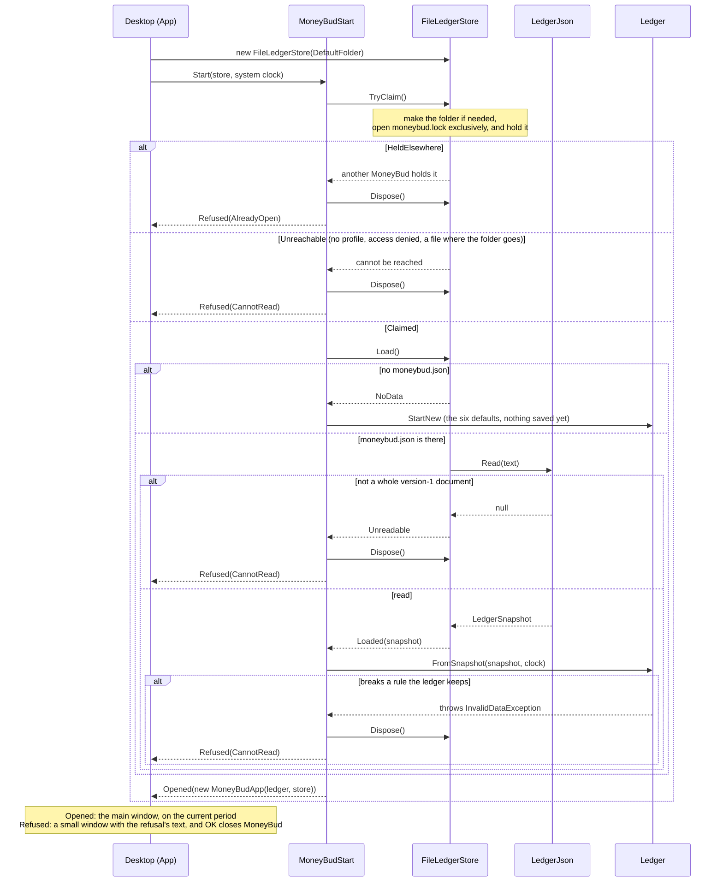
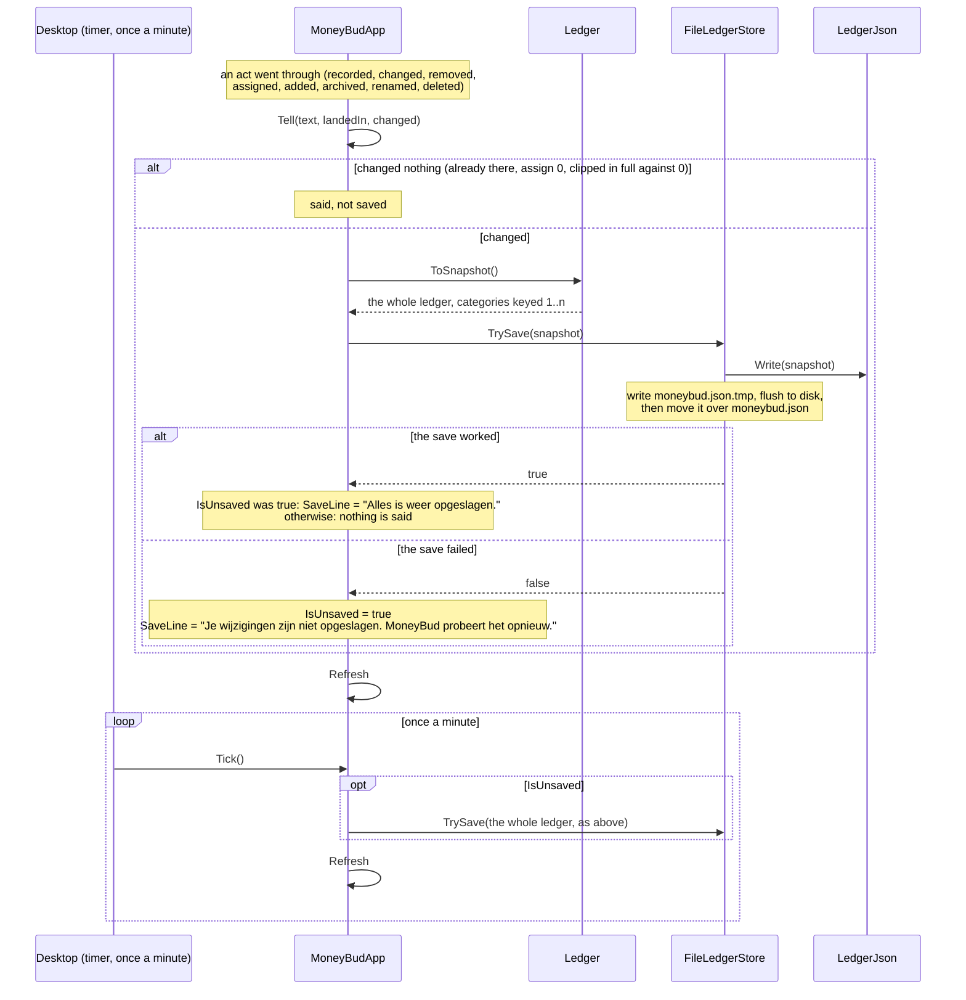

# 6. Runtime View

**What belongs here:** How the building blocks actually collaborate, for a few important
scenarios: the main use case, a tricky edge case, startup, error handling. Sequence diagrams work
well.

Cover the scenarios that are *hard to infer* from the static view. Documenting every interaction
is wasted effort — pick the ones where the collaboration is non-obvious.

---

> Note: "scenario" here means a runtime interaction between components, which is a different thing
> from a [Gherkin scenario](../../features/). Gherkin describes user-observable behaviour; this
> section describes internal collaboration.

This section became writable with the fifth increment, when a second building block that does
something arrived ([§5](05-building-block-view.md)). Four interactions are worth drawing.

- **Recording an expense through the screen.** Every act the user can take follows its shape, so it
  is not repeated for income, assigning or categories. Changing an entry and renaming a category
  follow it too. **Removing an entry is the one exception**, described in words after the diagram,
  because it is the only act split across two presses.
- **Starting MoneyBud**, **saving after an act, including a save that fails and is retried**, and
  **closing**. All three arrived with the persistence increment, when storage became a fourth
  building block ([ADR 0007](../decisions/0007-keeping-the-ledger.md)). In each of them the order of
  the calls is the point, and none can be read off the static view.

## Recording an expense through the screen

The main use case, and the one that shows where each decision is taken.

```mermaid
sequenceDiagram
    actor User
    participant Window as Desktop (window)
    participant Form as ExpenseForm
    participant App as MoneyBudApp
    participant Input as AmountInput
    participant Ledger
    participant Tekst

    User->>Window: types amount, category, label; presses "Uitgave toevoegen"
    Window->>Form: SubmitCommand
    Form->>App: RecordExpense(amount text, category, label, date or none)
    App->>Input: read the amount text
    alt not an amount, or ambiguous
        Input-->>App: NotAnAmount / Ambiguous
        App->>Tekst: the refusal, in Dutch
        Note over App,Ledger: the ledger is never called
    else read
        Input-->>App: a decimal, exactly as typed
        App->>Ledger: RecordExpense(decimal, category, date or today, label)
        Ledger-->>App: recorded, or refused for one reason
        App->>Tekst: the outcome or the refusal, in Dutch
        Note over App: recorded in a period other than the one on screen:<br/>add which period it went into
    end
    App->>App: set Notice, save if recorded (below), then Refresh (property changes)
    App-->>Form: the result
    Note over Form: recorded: clear amount, label, date<br/>refused: keep what was typed
    Window->>App: bindings read Overview again
    App->>Ledger: PeriodOverview.Of: CategoriesShownIn, BudgetFor, SpentOn,<br/>RemainingFor, UnassignedIn, ExpensesIn, IncomesIn
    Note over Window: RingControl draws from Ring's shares
```

What the diagram shows that the static view does not:

- **Two layers of refusal, in a fixed order.** The presentation layer refuses text that is not an
  amount, or that is ambiguous, before the domain sees anything. Only an amount that has been read
  reaches the ledger, and the ledger refuses by its own rules, in its own order
  ([§12](12-glossary.md), *Typing an amount*; [§8.2](08-crosscutting-concepts.md)).
- **The domain answers with a reason. The Dutch is added on the way back**, by `Tekst`. The ledger
  never sees a word the user reads ([§8.1](08-crosscutting-concepts.md)).
- **The screen decides nothing about where the expense lands.** The expense's date decides that, in
  the ledger. `MoneyBudApp` only compares the resulting period with the one on screen, to say where
  it went. The screen does not move ([§12](12-glossary.md), *Defaults, and entering while another
  period is shown*).
- **Nothing on the screen holds a figure.** `Refresh` changes nothing. It tells the window that
  everything may have changed, and each binding reads `Overview` again, which `PeriodOverview.Of`
  works out afresh from the ledger. So a figure on screen cannot be stale against the domain after an
  act. The cost is that the Overview is recomputed on every read. At the demo's data sizes nobody
  can notice that. If it ever matters, the place to cache is once per `Refresh`.

**The same `Refresh` runs on a timer.** Once a minute the Desktop calls `MoneyBudApp.Tick`, which
retries a save that failed (below) and then refreshes, so that the *Huidige periode* label follows
the clock when a period ends while MoneyBud is open ([§8.4](08-crosscutting-concepts.md)).

**The scenarios enter at `MoneyBudApp`**, not at the window. Every *When* step makes the same call
the form makes ([§8.4](08-crosscutting-concepts.md)). The window and the form's clearing are the
only parts of this diagram that no scenario runs through. The form's clearing has unit tests of its
own.

## Removing an entry: two presses, one call to the ledger

Since the corrections increment. Pressing *Verwijderen* on a loaded entry calls
`MoneyBudApp.AskToRemove`, which puts up a `Question` and holds the removal to be done beside it.
**Nothing reaches the ledger at this point**, and the Overview still lists the entry. The second
press answers the question. `Confirm` drops the question, calls `Ledger.RemoveExpense` or
`RemoveIncome`, empties the form if it still holds that entry, and announces the removal. `Decline`
drops the question, calls nothing, and says nothing. Stepping, loading another row, saving a change
or *Annuleren* drop a waiting question the same way, without calling the ledger. So the domain never
sees a removal the user did not confirm, and has no confirmation of its own
([§8.1](08-crosscutting-concepts.md), [§8.4](08-crosscutting-concepts.md)). The removal scenarios
run both presses, and check that the question is waiting while the entry is still listed.

## Starting MoneyBud: claim, then load, then check

Since the persistence increment. What the user meets is ruled in [§12](12-glossary.md), *What
MoneyBud keeps*. The storage choices are [ADR 0007](../decisions/0007-keeping-the-ledger.md)'s.



What the diagram shows that the static view does not:

- **The claim comes before the load.** A second start is refused before it reads a byte, so it never
  reads a file the first MoneyBud is part-way through replacing.
- **Three different failures end in one answer.** A folder that cannot be reached, a file that is
  not a whole version-1 document, and a document that breaks a domain rule are found in three
  different places: the store, the format and the ledger. All three become `CannotRead`, and in none
  of them has anything been written to the data file. That is the ruling "say so, touch nothing,
  close". `MoneyBudStart` lets go of the store at once, so a later start can claim it.
- **The Desktop chooses nothing.** It makes the store and shows what `MoneyBudStart` returns. The
  message's text is `StartResult.Refused.Text`, from `Tekst`.
- **A first start writes nothing.** The folder and `moneybud.lock` are made by the claim, but
  `moneybud.json` first appears with the first change. Closing straight away leaves the next start
  exactly where this one began.

## Saving after an act, and a save that fails

Every act that goes through ends in `MoneyBudApp.Tell`, which sets the notice and, **if the act
changed the ledger**, calls `Keep`. `Keep` hands the whole ledger to the store.



What the diagram shows that the static view does not:

- **A save is always the whole ledger**, so the save that finally works catches up every change that
  failed before it. Nothing records which changes were missed, because nothing needs to.
- **The act is done before the save is tried.** A failed save undoes nothing and refuses nothing.
  The ledger and the screen already hold the change, and only the save line says it is not kept.
- **Only an act that changed the ledger saves, and so retries.** A refusal, an unchanged save, a
  declined question, adding a name already there, assigning zero, and a negative assignment clipped
  in full against a *Budget* of zero change nothing. So they neither save nor retry. As first built,
  every act that went through saved. `spec-reviewer` found that such an act could then show a
  "not saved" that described no change, and `Tell(changed:)` was the fix.
- **The save line is not the notice.** `SaveLine` is its own property, and the window shows it as a
  line of its own beside the notice and the question ([§8.4](08-crosscutting-concepts.md)). "Not
  saved" stays until a save works, stepping included. "Saved again" stays until the next act or step.
- **The timer is the Desktop's; what it does is the presentation layer's.** `Tick` retries only when
  something is unsaved, so on a healthy disk the timer writes nothing.

## Closing

The window's `Closed` event stops the timer and calls `MoneyBudApp.Close`. If something is unsaved,
`Close` makes **one** last `TrySave` of the whole ledger. Whatever comes of it, nothing is asked. It
then disposes the store, which closes `moneybud.lock` and lets a later start claim the data. If the
process dies instead of closing, the operating system closes the lock file for it, so a crash never
leaves the data held. A save cut off by that crash leaves `moneybud.json` as it was and at most a
`moneybud.json.tmp`, which the next start never reads, and which the next save writes over
([ADR 0007](../decisions/0007-keeping-the-ledger.md)).
