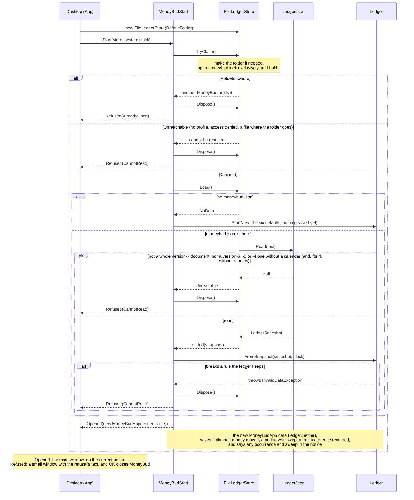
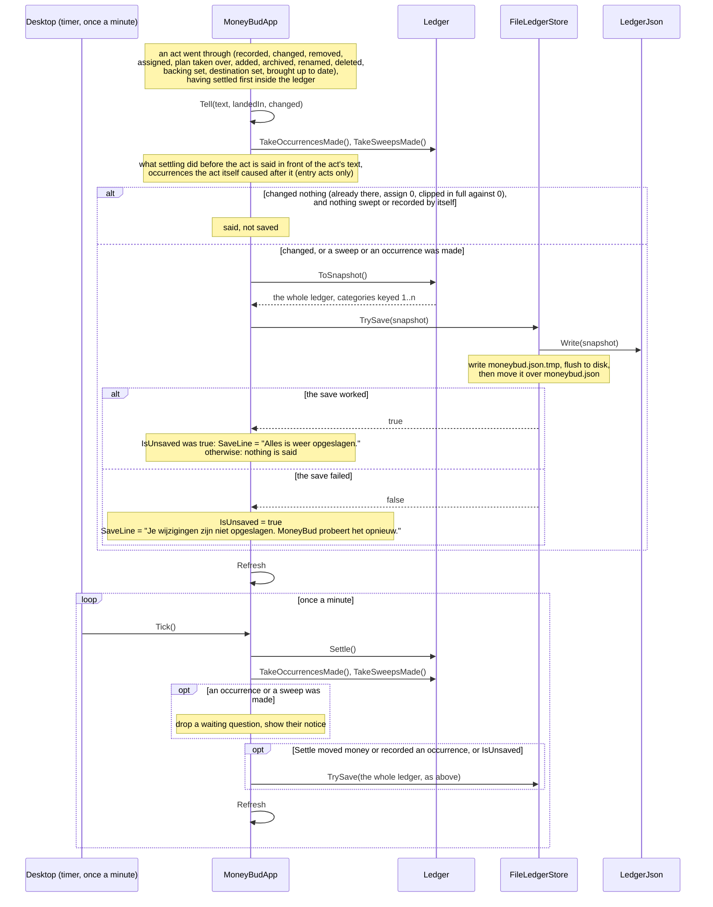

# 6. Runtime View

**What belongs here:** How the building blocks actually collaborate, for a few important
scenarios: the main use case, a tricky edge case, startup, error handling. Sequence diagrams work
well.

Cover the scenarios that are *hard to infer* from the static view. Documenting every interaction
is wasted effort — pick the ones where the collaboration is non-obvious.

---

> Note: "scenario" here means a runtime interaction between components, which is a different thing
> from a [Gherkin scenario](../../features/). Gherkin describes user-observable behaviour; this
> section describes internal collaboration.

This section became writable with the fifth increment, when a second building block that does
something arrived ([§5](05-building-block-view.md)). These interactions are worth drawing or
describing.

- **Recording an expense through the screen.** Every act the user can take follows its shape, so it
  is not repeated for income, assigning or categories. Changing an entry and renaming a category
  follow it too, and so does taking over a plan, with one difference inside the ledger, described
  in words after the diagram. **Removing an entry is the one exception**, also described in words,
  because it is the only act split across two presses.
- **Starting MoneyBud**, **saving after an act, including a save that fails and is retried**, and
  **closing**. All three arrived with the persistence increment, when storage became a fourth
  building block ([ADR 0007](../decisions/0007-keeping-the-ledger.md)). In each of them the order of
  the calls is the point, and none can be read off the static view.
- **How a balance is worked out**, since the accounts increment, in words. No building block holds
  a balance, so where one comes from is exactly what the static view cannot show.
- **Settling, and the backing act**, since the backing increment, in words. It is the one thing
  MoneyBud does because a period began rather than because it was asked, and it runs from three
  places: inside every act, when the screen opens and on the timer
  ([ADR 0009](../decisions/0009-movements-are-entries.md)).
- **The sweep at settling**, since the sweep increment, in words: what settling does at a period's
  end, and why a sweep is said and saved straight away wherever settling ran, a refused act included
  ([ADR 0010](../decisions/0010-sweeps-and-period-ends.md)).
- **Settling day by day**, since the recurring-entries increment, in words: settling steps from event
  to event, so an occurrence of a recurring entry is recorded before its period is swept, and it is
  said and saved straight away, as a sweep is. An act that sets up or moves a repeat settles again
  after its change, and the notice says each thing where it happened
  ([ADR 0011](../decisions/0011-recurring-entries.md)).
- **Changing the period start day**, since the start-day increment, in words: a question worded from a
  preview, then one act that settles under the old calendar, moves plans made ahead, swaps the calendar
  and, when it ends the current period, passes the boundary itself, dated today, because settling
  cannot ([ADR 0012](../decisions/0012-the-calendar-is-a-history.md)).

## Recording an expense through the screen

The main use case, and the one that shows where each decision is taken.

```mermaid
sequenceDiagram
    actor User
    participant Window as Desktop (window)
    participant Form as ExpenseForm
    participant App as MoneyBudApp
    participant Input as AmountInput
    participant Ledger
    participant Tekst

    User->>Window: types amount, category, label; presses "Uitgave toevoegen"
    Window->>Form: SubmitCommand
    Form->>App: RecordExpense(amount text, category, label, date or none)
    App->>Input: read the amount text
    alt not an amount, or ambiguous
        Input-->>App: NotAnAmount / Ambiguous
        App->>Tekst: the refusal, in Dutch
        Note over App,Ledger: the ledger is never called
    else read
        Input-->>App: a decimal, exactly as typed
        App->>Ledger: RecordExpense(decimal, category, date or today, label)
        Ledger-->>App: recorded, or refused for one reason
        App->>Tekst: the outcome or the refusal, in Dutch
        Note over App: recorded in a period other than the one on screen:<br/>add which period it went into
    end
    App->>App: set Notice, save if recorded (below), then Refresh (property changes)
    App-->>Form: the result
    Note over Form: recorded: clear amount, label, date<br/>refused: keep what was typed
    Window->>App: bindings read Overview again
    App->>Ledger: PeriodOverview.Of: PlanOfferedIn, CategoriesShownIn, BudgetFor, SpentOn,<br/>RemainingFor, UnassignedIn, ExpensesIn, IncomesIn
    Note over Window: RingControl draws from Ring's shares
```

What the diagram shows that the static view does not:

- **Two layers of refusal, in a fixed order.** The presentation layer refuses text that is not an
  amount, or that is ambiguous, before the domain sees anything. Only an amount that has been read
  reaches the ledger, and the ledger refuses by its own rules, in its own order
  ([§12](12-glossary.md), *Typing an amount*; [§8.2](08-crosscutting-concepts.md)).
- **The domain answers with a reason. The Dutch is added on the way back**, by `Tekst`. The ledger
  never sees a word the user reads ([§8.1](08-crosscutting-concepts.md)).
- **The screen decides nothing about where the expense lands.** The expense's date decides that, in
  the ledger. `MoneyBudApp` only compares the resulting period with the one on screen, to say where
  it went. The screen does not move ([§12](12-glossary.md), *Defaults, and entering while another
  period is shown*).
- **Nothing on the screen holds a figure.** `Refresh` changes nothing. It tells the window that
  everything may have changed, and each binding reads `Overview` again, which `PeriodOverview.Of`
  works out afresh from the ledger. So a figure on screen cannot be stale against the domain after an
  act. The cost is that the Overview is recomputed on every read. At the demo's data sizes nobody
  can notice that. If it ever matters, the place to cache is once per `Refresh`.

**The same `Refresh` runs on a timer.** Once a minute the Desktop calls `MoneyBudApp.Tick`, which
settles money planned for a period that has begun, sweeps a period that has ended and records the
occurrences that have come due (*Settling*, *The sweep at settling* and *Settling day by day*, below),
retries a save that failed
(below) and then refreshes, so that the *Huidige periode* label follows
the clock when a period ends while MoneyBud is open ([§8.4](08-crosscutting-concepts.md)).

**The scenarios enter at `MoneyBudApp`**, not at the window. Every *When* step makes the same call
the form makes ([§8.4](08-crosscutting-concepts.md)). The window and the form's clearing are the
only parts of this diagram that no scenario runs through. The form's clearing has unit tests of its
own.

## Taking over a plan: one call in, one assignment per figure

Since the opening-a-period increment. The button calls `MoneyBudApp.TakeOverPlan`, which calls
`Ledger.TakeOverPlan` once, with the **period on screen**, whatever period the assign form is set to.
Inside the ledger that one call becomes several: after checking for a past period, it asks
`PlanOfferedIn` for the plan and calls `Assign` once per figure. So the budgets are written by the
same member as a hand-made assignment, and the screen sees one act. It gets one result, sets one
notice naming the period, saves once through `Tell` and refreshes once. **The offer is not cleared
by anyone.** It is part of the Overview, which `PeriodOverview.Of` works out on every read, and once
the period has a *Budget* above zero `PlanOfferedIn` answers null. The same read makes the button
and the grey figures go when a period becomes past ([§8.4](08-crosscutting-concepts.md)).

## Removing an entry: two presses, one call to the ledger

Since the corrections increment. Pressing *Verwijderen* on a loaded entry calls
`MoneyBudApp.AskToRemove`, which puts up a `Question` and holds the removal to be done beside it.
**Nothing reaches the ledger at this point**, and the Overview still lists the entry. The second
press answers the question. `Confirm` drops the question, calls `Ledger.RemoveExpense` or
`RemoveIncome`, empties the form if it still holds that entry, and announces the removal. `Decline`
drops the question, calls nothing, and says nothing. Stepping, loading another row, saving a change
or *Annuleren* drop a waiting question the same way, without calling the ledger. So the domain never
sees a removal the user did not confirm, and has no confirmation of its own
([§8.1](08-crosscutting-concepts.md), [§8.4](08-crosscutting-concepts.md)). The removal scenarios
run both presses, and check that the question is waiting while the entry is still listed. Removing a
transfer or a balance correction from an account's history, since the accounts increment, takes the
same two presses.

## A balance: worked out on every read, by nobody in particular

Since the accounts increment ([ADR 0008](../decisions/0008-balance-is-worked-out.md)). It earns a
place here because the static view shows no balance anywhere: `Account` has none, and no act writes
one.

**An act writes an entry.** Recording, changing or removing an income, expense or transfer, and
correcting a balance, each adds, replaces or removes one entry in the ledger's lists, and nothing
else. `MoneyBudApp` then refreshes, as after any act.

**The redraw works every figure out again.** The window's bindings read the following, and each
recomputes from the entries:

- `MoneyBudApp.Accounts`: one `Ledger.BalanceOf` per account.
- `NetWorth`: every `BalanceOf` again, summed.
- `History`, if an account's history is open: `Ledger.HistoryOf`, and `Ledger.DifferenceOf` for
  each balance correction.

`BalanceOf` takes the account's latest typed balance, by date then id, and adds every income,
expense and transfer on the account that it does not hold and that is dated today or earlier.
`DifferenceOf` compares a typed balance with the previous one and with what lies between them.

**So a late receipt changes two figures by one entry, and neither is updated by anyone.** Record an
expense dated before a balance correction, and the next read finds:

- the **balance** unchanged, because the correction holds the expense;
- the **difference** smaller, because it now explains part of the correction.

No code has to know that both should change, because neither is stored. The once-a-minute refresh
runs the same reads, which is how a future-dated income reaches its balance on its date without any
act.

**Since the backing increment `BalanceOf` also adds movements** on either side of the account, as it
adds transfers, and leaves out a movement from an account to itself. Nothing else about this
changed: a movement is an entry, and a balance is still worked out from the entries.

## Settling: money MoneyBud moves because a period began

Since the backing increment ([ADR 0009](../decisions/0009-movements-are-entries.md)). Money assigned
to a backed category for a later period is not written when it is assigned. It is written when that
period begins, by `Ledger.Settle`, because only then is it known which account backs the category and
which account is the pool. The static view shows `Settle` as one member. What it cannot show is that
three callers share it, and why their order matters.

**Inside the ledger, before every act.** Every `Ledger` member that changes the ledger calls `Settle`
first. So the first act on or after a period's first day writes that period's movements before it
does its own work. A balance correction typed on 1 November therefore gets an id higher than the
movements settled for 1 November, and holds them, which is what the scenarios assert. An assignment
made on that day moves money on top of the settled amount, not before it.

**`MoneyBudApp`, when it is made.** `MoneyBudStart` loads the ledger and makes the screen. The
constructor calls `Settle`, and if anything moved it calls `Keep`, so a start after days away saves
the movements before the user sees the strip. The balances shown at once are right.

**`MoneyBudApp.Tick`, once a minute.** `Tick` calls `Settle`, and saves if anything moved or if an
earlier save failed. Then it refreshes. So when a period begins while MoneyBud is open, the money
moves within a minute, without an act, and the strip shows it.

**`Settle` itself** looks at each period that began after `settledThrough` and on or before today, in
order. For each backed category with a *Budget* above zero there, it writes an `In` movement from
the pool account to the backing account, dated the period's first day, with the next id. Then it sets
`settledThrough` to today. A second call the same day finds nothing to do. **It can see the backing
and the pool account of that day, however late it runs**, because nothing can change the ledger
between that day and the first act, start or tick after it, and each of those settles first. Since
the sweep increment it also records and sweeps the period that ended, before the planned money moves
(*The sweep at settling*, below). **Since the recurring-entries increment the "nothing to do the same
day" no longer holds as a rule**: `Settle` has no once-a-day early return, because a repeat set up or
moved back in the past has occurrences due on days already settled through, and they are recorded by
the next call (*Settling day by day*, below). A second call with nothing due still finds nothing to
do, which is what the tick relies on.

**The one gap.** An act that settles and is then refused does not save. It has changed nothing of its
own, and only an act that changes the ledger saves (`Tell(changed:)`, below). The movements its
settling wrote stay unsaved until the next change. The tick does not save them either: its own
`Settle` finds nothing left to do, and nothing is marked unsaved, so `Close` makes no last attempt.
Nothing is lost all the same. If MoneyBud closes or crashes first, the next start settles the kept
data again, from the same `settledThrough`, and writes the same movements, because nothing could have
changed in between. **Since the sweep increment the gap no longer holds for a sweep**: an act whose
settling swept a period saves, refused or not (*The sweep at settling*, below;
[ADR 0010](../decisions/0010-sweeps-and-period-ends.md)). **Since the recurring-entries increment it
no longer holds for an occurrence either** (*Settling day by day*, below;
[ADR 0011](../decisions/0011-recurring-entries.md)). Planned money keeps the gap.

**A read never settles.** `PeriodOverview.Of`, `BalanceOf`, `AccumulatedFor` and the rest only read.
In the minute between a period beginning and the next tick, *Opgebouwd* counts that period's
*Budget* as planned, since it has not been settled yet, so the figure does not dip and then recover.

## The sweep at settling: recorded, then swept, then said and saved

Since the sweep increment ([ADR 0010](../decisions/0010-sweeps-and-period-ends.md)). The sweep is not
a new caller. It is one more thing `Settle` does, so it runs from the same three places as settling
does, and what is worth drawing is what each of them then does with it.

**Inside `Settle`, at each period boundary passed, in order:**

1. The ended period's **period-end record** is written: its first day and the categories backed at
   this moment. From now on `PeriodLeftover` for that period is worked out under this set, whatever is
   backed or unbacked later.
2. If a destination is set and the period's difference is above zero, a `Swept` `In` movement is
   written from the pool account to the destination's backing account, dated the new period's first
   day, with the next id. The ledger adds it to its list of **sweeps made**.
3. The new period's planned money moves, as before.

Then `settledThrough` moves to today. Nothing is said by the ledger: it only keeps the sweeps made
until they are asked for.

**Every caller then takes the sweeps made, says them and saves**, because a sweep is announced
exactly once (§12, *Ruled at the scenario stage*, ruling 1):

- **An act.** `Tell`, `Refuse` and `SayNothing` each call `Ledger.TakeSweepsMade()` first. Any sweep
  is said **in front of** whatever the act says, one sentence per period, oldest first, and the
  ledger is kept **even when the act changed nothing or was refused**. This is the one place the rule
  "only an act that changed the ledger saves" gives way, and only for a sweep.
- **Opening.** The constructor settles and keeps the ledger if anything moved, a sweep included, then
  takes the sweeps made and puts them in the notice. So several periods swept at one start are one
  notice with a sentence each.
- **The tick.** `Tick` settles, and if a sweep was made it **drops a waiting removal question** and
  shows the sweep's notice: a question and a notice are never shown together, and money moved. It
  then keeps the ledger.

**Why each sweep must be saved at once.** If it waited for the next change, as planned money may, a
restart before that change would settle the kept data again, sweep the same period again, and
announce it a second time. Planned money settled again is invisible, so it keeps ADR 0009's gap
(*Settling*, above). A sweep is not.

**Pressing *Restant bijwerken* in the minute after a boundary.** For up to a minute the screen can
still show the button on a period that settling is about to sweep. `MoneyBudApp.BringSweepUpToDate`
therefore settles first and asks for the line again. If the line no longer offers the button, it
moves nothing more: it says the sweep settling just made, through `SayNothing`, and saves. Otherwise it
calls `Ledger.BringUpToDate`, which moves exactly the difference, dated today. `spec-reviewer` found
that without this the ledger would throw, because the button it was asked to press was no longer on
the line.

**The *Restant naar* list writing back is not an act.** Like the *Staat op* lists, it writes back
what it shows on first show and on every redraw. `Ledger.SetSweepDestination` recognises the
destination already set **before settling** and returns `Unchanged`, and `MoneyBudApp` then says
nothing, saves nothing and redraws nothing (*Backing a category*, below, for the same pattern).

## Settling day by day: occurrences before their period's sweep

Since the recurring-entries increment ([ADR 0011](../decisions/0011-recurring-entries.md)). An
occurrence of a recurring entry is written by settling, as planned money and a sweep are, so it runs
from the same three places. What changed is the shape of settling's loop, and where an act's notice
puts what settling did.

**Inside `Settle`, event by event.** Each step takes whichever comes first:

- **an occurrence**, when the earliest next date among the running repeats is due by today and falls
  before the next period boundary. It is a copy of the repeat's latest occurrence (amount, label,
  category, account), dated the next date, with the next id. It is never checked and never refused,
  and one on an archived category brings the category back. The ledger adds it to its list of
  **occurrences made**, and the repeat's next date moves on a step;
- **the next period boundary**, when it has begun: the period-end record, the sweep and the planned
  money, exactly as in *The sweep at settling*, above, and `settledThrough` moves to that day.

When neither is left, `settledThrough` moves to today. Because an occurrence must come *before* the
boundary to go first, **on a boundary day the boundary comes first** and that day's occurrences after
it. Several due on one day are recorded in the order their repeats were set up, which is the order the
ledger holds them in. So after MoneyBud was closed across a period end, every occurrence dated in the
ended period is in it before the period is swept, as if MoneyBud had been open (§12, *Recurring
entries*, follow-up 5). A clock turned back finds nothing due and passes no boundary.

**An act that sets up or moves a repeat settles again after its change.** Recording an expense or
income with a frequency, a change that gives a one-off a frequency, and any change that goes through
to the occurrence that sets a repeat (the latest, or a stopped repeat's last) each call `Settle` once
more inside the ledger once the change is made. Only a new frequency or a new date on it moves the
next date, and only then can anything come due. So what is already due is recorded **within the same act** (follow-up 4), rather than
by the next tick in a notice of its own. By then the act's first settling has passed every boundary
up to today, so these occurrences are simply recorded, each into the period its date is in. One that
lands in a period already swept is a late entry there like any other, and the period's line shows the
difference.

**Said in the order it happened.** `MoneyBudApp` takes the occurrences made wherever it takes the
sweeps made: in the constructor, in `Tick`, and in `Tell`, `Refuse` and `SayNothing`. What settling
did becomes one *"Herhaald: …"* sentence naming every occurrence with its day, a sentence for each
category an occurrence brought back, then the sweep sentences. **For the four entry acts**, recording
and changing an expense or an income, `MoneyBudApp.SettleBeforeActing` settles first, in the screen,
and holds what that did. The act then calls the ledger, whose own settling finds nothing left, and
whatever the act itself caused is taken afterwards. The notice is: what settling did before the act,
the act's own sentence, what the act caused. For every other act all of it goes in front, as for a
sweep. This order was ruled at the build (§12, *Recurring entries: chosen in the build*); the plan
had put everything MoneyBud did by itself first, which broke an approved corrections scenario.

**Saved straight away, for the sweep's reason.** An occurrence is announced, so settling it again
after a restart would announce it twice. The notice's `Settled.Said` is not null whenever an
occurrence was recorded, so `Tell`, `Refuse` and `SayNothing` keep the ledger, a refused act and one
that changed nothing included. The constructor and `Tick` keep it because `Settle` returned that it
changed something. **On the tick** an occurrence's notice drops a waiting removal question, as a
sweep's does.

**An entry open in its form can stop being the latest.** Every `Refresh` has the expense and income
forms re-read `CanChangeFrequency` through `Ledger.SetsTheRepeat`. So when the tick records the next
occurrence while the latest is open in *Wijzigen*, the form now shows *Eenmalig*, locked, and saving
it changes that entry alone.

**The *Herhalen* list writing back is not an act.** It writes back what it shows, like the account
list. `ChosenFrequency` ignores a write of nothing and any write while locked, and a write of the
value already held changes nothing. The list only sets a field of the form; the ledger hears of it
when the entry is recorded or saved.

## Changing the period start day: a preview, a question, and a boundary passed by the act

Since the start-day increment ([ADR 0012](../decisions/0012-the-calendar-is-a-history.md)). What the
user meets is ruled in [§12](12-glossary.md), *A configurable period start day*. The static view shows
one list and one act. What it cannot show is that the act has two presses, like removing, and that the
second can pass a period boundary without settling, which until now only settling did.

**The first press asks, and reaches the ledger only to read.** The *Periode begint op* list sets
`MoneyBudApp.StartDayChoice`. A null, the day already set, or the day already asked about stops there,
so the list's write-back on every redraw does nothing. Any other day calls `Ledger.PreviewStartDay`,
which works out the change on a new calendar and returns what it would do, the new current period and
any period it would end, **without changing the ledger or settling**. `MoneyBudApp` words the question
from that, with *Wijzigen* as its confirming word, holds the change to be made beside it, and notes the
day it was asked. While it waits, the list shows the day asked about.

**Anything that drops the question puts the list back without calling the ledger.** *Annuleren*,
stepping, anything said, choosing the day already set, and the tick on a new day. The last matters
because the question names a current period: after midnight *Wijzigen* could act on another.

**The second press is one act, in this order:**

0. **A question asked on an earlier day is dropped, not answered**: nothing changes and nothing is
   said, as if the tick had come first. The tick alone held that only to the minute, and
   `spec-reviewer` found *Wijzigen* pressed in the minute after midnight acting on a period the
   question did not name.
1. `MoneyBudApp` settles first (`SettleBeforeActing`), and holds what that did, so it can be said in
   front.
2. It notes the current period, the period on screen and the assign form's period, and calls
   `Ledger.ChangeStartDay`.
3. Inside the ledger: the day already set would return at once, but cannot reach here. Otherwise it
   **settles under the old calendar**, as every act does.
4. It **re-keys** each budget for a period after the current one whose first day no longer starts a
   period, adding into the period that day falls in. A plan whose old first day settling has already
   passed, which only a clock once set ahead can leave, is noted as settled already, so the steps below
   do not move its money a second time (a `spec-reviewer` finding).
5. It **swaps in the new calendar**. From here, every period is found under it.
6. **If the current period has ended on the spot**, it calls `PassInto(new current period, today)`:
   the ended period's period-end record with what is backed now, its sweep if a destination is set and
   there is something to sweep, and the new period's planned money, **all dated today**, and the sweep
   added to the sweeps made. **Otherwise**, a plan made ahead that has landed in the current period has
   its backed money moved now, dated today, since settling has already passed that period's first day.
7. Back on the screen, the period on screen and the assign form's period each go to the new current
   period if they were on the current period, and otherwise to the period their first day now falls in.
8. `Tell` says the change, then takes the sweeps made and says them after it, in the order they
   happened, and keeps the ledger once.

**Why the act passes the boundary itself.** `Settle` looks for the next boundary after
`settledThrough`, which is today. A change that ends the current period puts a boundary on a day already
settled, which `Settle` would never pass. So the act passes it with settling's own steps, through the
same `PassInto`, and gives it today's date, which the rulings ask for and settling could not have given.
`settledThrough` does not move: the change leaves nothing unsettled after today. And because the act
sweeps without settling's first-start test, a period ended by a change is swept even when its new end
falls before the first start, as ruled at the scenario stage.

**Saved once, said in order.** The notice is: what settling did before the change, the change, the
sweep of the period it ended. One `Tell`, one save, which the headless run checked.

## Backing a category: one choice, at most one movement

`CategoryRow.ChosenBacking` is bound two-way to the row's *Staat op* list. When it is set, it calls
`MoneyBudApp.SetBacking`, which calls `Ledger.SetBacking`.

- **The choice already set is recognised first, before settling**, and returns `Unchanged`.
  `MoneyBudApp` then says nothing, saves nothing and redraws nothing. This matters because every
  row's list writes back its current choice whenever the rows are redrawn, and that happens after
  every act. If the write-back counted as an act, it would replace the last act's notice.
- **Otherwise the ledger settles**, then works out what moves under the backing being left: this
  period's *Remaining* when backing, or `ThereFor` when re-pointing or unbacking. It then writes the
  new backing, with a fresh mark from the id counter, and at most one movement.
- **`MoneyBudApp` announces the result** through `Tekst.BackingSet`. The notice names the money only
  when it moved between two accounts. It saves through `Tell` like any act, and the rows are redrawn.
  Their lists write back the new choice, which is now the one set, so nothing further happens.

`Assign` in the current period follows the same pattern inside the ledger: settle, write the budget,
then write one movement for a backed category.

## Starting MoneyBud: claim, then load, then check

Since the persistence increment. What the user meets is ruled in [§12](12-glossary.md), *What
MoneyBud keeps*. The storage choices are [ADR 0007](../decisions/0007-keeping-the-ledger.md)'s.

```mermaid
sequenceDiagram
    participant Desktop as Desktop (App)
    participant Start as MoneyBudStart
    participant Store as FileLedgerStore
    participant Json as LedgerJson
    participant Ledger

    Desktop->>Store: new FileLedgerStore(DefaultFolder)
    Desktop->>Start: Start(store, system clock)
    Start->>Store: TryClaim()
    Note over Store: make the folder if needed,<br/>open moneybud.lock exclusively, and hold it
    alt HeldElsewhere
        Store-->>Start: another MoneyBud holds it
        Start->>Store: Dispose()
        Start-->>Desktop: Refused(AlreadyOpen)
    else Unreachable (no profile, access denied, a file where the folder goes)
        Store-->>Start: cannot be reached
        Start->>Store: Dispose()
        Start-->>Desktop: Refused(CannotRead)
    else Claimed
        Start->>Store: Load()
        alt no moneybud.json
            Store-->>Start: NoData
            Start->>Ledger: StartNew (the six defaults, nothing saved yet)
        else moneybud.json is there
            Store->>Json: Read(text)
            alt not a whole version-7 document, nor a version-6, -5 or -4 one without a calendar (and, for 4, without repeats)
                Json-->>Store: null
                Store-->>Start: Unreadable
                Start->>Store: Dispose()
                Start-->>Desktop: Refused(CannotRead)
            else read
                Json-->>Store: LedgerSnapshot
                Store-->>Start: Loaded(snapshot)
                Start->>Ledger: FromSnapshot(snapshot, clock)
                alt breaks a rule the ledger keeps
                    Ledger-->>Start: throws InvalidDataException
                    Start->>Store: Dispose()
                    Start-->>Desktop: Refused(CannotRead)
                end
            end
        end
        Start-->>Desktop: Opened(new MoneyBudApp(ledger, store))
        Note over Start,Ledger: the new MoneyBudApp calls Ledger.Settle(),<br/>saves if planned money moved, a period was swept or an occurrence recorded,<br/>and says any occurrence and sweep in the notice
    end
    Note over Desktop: Opened: the main window, on the current period<br/>Refused: a small window with the refusal's text, and OK closes MoneyBud
```

What the diagram shows that the static view does not:

- **The claim comes before the load.** A second start is refused before it reads a byte, so it never
  reads a file the first MoneyBud is part-way through replacing.
- **Three different failures end in one answer.** A folder that cannot be reached, a file that is
  not a whole document of the current version, and a document that breaks a domain rule are found in three
  different places: the store, the format and the ledger. All three become `CannotRead`, and in none
  of them has anything been written to the data file. That is the ruling "say so, touch nothing,
  close". `MoneyBudStart` lets go of the store at once, so a later start can claim it.
- **The Desktop chooses nothing.** It makes the store and shows what `MoneyBudStart` returns. The
  message's text is `StartResult.Refused.Text`, from `Tekst`.
- **A first start writes nothing.** The folder and `moneybud.lock` are made by the claim, but
  `moneybud.json` first appears with the first change. Closing straight away leaves the next start
  exactly where this one began. A new ledger has settled through today, so settling writes nothing
  either.
- **The version in the diagram is the current one**: version 1 when this was drawn, version 2 since
  the accounts increment, version 3 since the backing increment, version 4 since the sweep
  increment, version 5 since the recurring-entries increment, and version 6 since the change to
  *Opgebouwd* on 2026-09-28. **Version 4 is the first older version that is read**, as data with no
  repeats, unless it carries a `repeats` list; version 5 is read with a backing's two remembered figures
  worked out again. Versions 1 to 3 are met as unreadable ([ADR 0011](../decisions/0011-recurring-entries.md)).
  **Version 7 since the start-day increment** (2026-09-29), which reads version 6 as a calendar never
  changed, and 5 and 4 through it; any of those three carrying a `calendar` is unreadable
  ([ADR 0012](../decisions/0012-the-calendar-is-a-history.md)). `FromSnapshot` rebuilds the calendar's
  history first, so a kept history no series of changes could have made is one more thing the ledger
  refuses.
- **Loaded data may be saved at once.** Since the backing increment, a start on or after the first
  day of a period that has not been settled moves that period's planned money and saves it before
  the user does anything (*Settling*, above). Since the sweep increment it may also sweep the periods
  that ended while MoneyBud was closed, each at its own end, and say so in one notice (*The sweep at
  settling*, above). Since the recurring-entries increment it may also record every occurrence that
  came due while it was closed, day by day and before each period's sweep, named in the same notice
  (*Settling day by day*, above).

## Saving after an act, and a save that fails

Every act that goes through ends in `MoneyBudApp.Tell`, which sets the notice and, **if the act
changed the ledger**, calls `Keep`. `Keep` hands the whole ledger to the store.

```mermaid
sequenceDiagram
    participant Timer as Desktop (timer, once a minute)
    participant App as MoneyBudApp
    participant Ledger
    participant Store as FileLedgerStore
    participant Json as LedgerJson

    Note over App: an act went through (recorded, changed, removed,<br/>assigned, plan taken over, added, archived, renamed, deleted,<br/>backing set, destination set, brought up to date),<br/>having settled first inside the ledger
    App->>App: Tell(text, landedIn, changed)
    App->>Ledger: TakeOccurrencesMade(), TakeSweepsMade()
    Note over App: what settling did before the act is said in front of the act's text,<br/>occurrences the act itself caused after it (entry acts only)
    alt changed nothing (already there, assign 0, clipped in full against 0),<br/>and nothing swept or recorded by itself
        Note over App: said, not saved
    else changed, or a sweep or an occurrence was made
        App->>Ledger: ToSnapshot()
        Ledger-->>App: the whole ledger, categories keyed 1..n
        App->>Store: TrySave(snapshot)
        Store->>Json: Write(snapshot)
        Note over Store: write moneybud.json.tmp, flush to disk,<br/>then move it over moneybud.json
        alt the save worked
            Store-->>App: true
            Note over App: IsUnsaved was true: SaveLine = "Alles is weer opgeslagen."<br/>otherwise: nothing is said
        else the save failed
            Store-->>App: false
            Note over App: IsUnsaved = true<br/>SaveLine = "Je wijzigingen zijn niet opgeslagen. MoneyBud probeert het opnieuw."
        end
    end
    App->>App: Refresh

    loop once a minute
        Timer->>App: Tick()
        App->>Ledger: Settle()
        App->>Ledger: TakeOccurrencesMade(), TakeSweepsMade()
        opt an occurrence or a sweep was made
            Note over App: drop a waiting question, show their notice
        end
        opt Settle moved money or recorded an occurrence, or IsUnsaved
            App->>Store: TrySave(the whole ledger, as above)
        end
        App->>App: Refresh
    end
```

What the diagram shows that the static view does not:

- **A save is always the whole ledger**, so the save that finally works catches up every change that
  failed before it. Nothing records which changes were missed, because nothing needs to.
- **The act is done before the save is tried.** A failed save undoes nothing and refuses nothing.
  The ledger and the screen already hold the change, and only the save line says it is not kept.
- **Only an act that changed the ledger saves, and so retries.** A refusal, an unchanged save, a
  declined question, adding a name already there, assigning zero, and a negative assignment clipped
  in full against a *Budget* of zero change nothing. So they neither save nor retry. As first built,
  every act that went through saved. `spec-reviewer` found that such an act could then show a
  "not saved" that described no change, and `Tell(changed:)` was the fix. **The one exception, since
  the sweep increment, is a sweep**: if the act's own settling swept a period, the ledger has changed
  and is saved, a refusal included (*The sweep at settling*, above). A refusal is drawn beside the
  `Refuse`, which the diagram does not draw, saves only for a sweep. **Since the recurring-entries
  increment an occurrence is the second exception**, for the same reason (*Settling day by day*,
  above).
- **The save line is not the notice.** `SaveLine` is its own property, and the window shows it as a
  line of its own beside the notice and the question ([§8.4](08-crosscutting-concepts.md)). "Not
  saved" stays until a save works, stepping included. "Saved again" stays until the next act or step.
- **The timer is the Desktop's; what it does is the presentation layer's.** `Tick` saves only when
  something is unsaved or, since the backing increment, when settling moved money because a period
  began. So on a healthy disk the timer writes at most once a period, and since the
  recurring-entries increment also on each day an occurrence comes due while MoneyBud is open.
- **Choosing the backing already set is not an act.** It reaches neither the ledger's settling nor
  `Tell`, so it neither saves nor retries (*Backing a category*, above). Nor is choosing the sweep
  destination already set, nor the period start day already set; and choosing another start day only
  asks, so it saves nothing until *Wijzigen* (*Changing the period start day*, above).

## Closing

The window's `Closed` event stops the timer and calls `MoneyBudApp.Close`. If something is unsaved,
`Close` makes **one** last `TrySave` of the whole ledger. Whatever comes of it, nothing is asked. It
then disposes the store, which closes `moneybud.lock` and lets a later start claim the data. If the
process dies instead of closing, the operating system closes the lock file for it, so a crash never
leaves the data held. A save cut off by that crash leaves `moneybud.json` as it was and at most a
`moneybud.json.tmp`, which the next start never reads, and which the next save writes over
([ADR 0007](../decisions/0007-keeping-the-ledger.md)).
